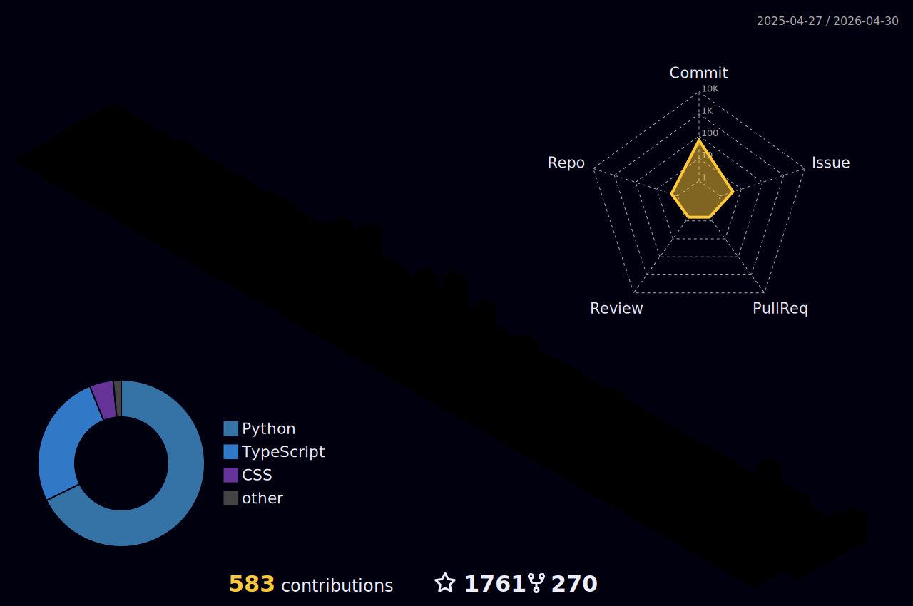

### Hi, I'm Barry! 👋

### Welcome to my  GitHub Profile

## ⚡ Platforms

## ⚡ Tec Stacks

  

## 🌎 Find me

## Introducing Bardiafa 🙋‍♂️

👋 Hey there! I'm a Senior Software Engineer with 6 years of experience, a Senior Product Manager, and a company Scrum Master. I'm also well-versed in HTML and CSS and UI/UX with a rating of 9/10, and a 4/10 in Python. 💻

I believe in the power of hard work and never giving up also having vision, and I apply that mindset every day with my amazing team at Mizegerd.tech. 🤝 We're not any other digital marketing agency - we go above and beyond to provide top-notch services to our clients.

🔒 With my expertise in Software Engineering, I know how to build a software product and keep UI/UX perfect. 💪

💡 But to me, nothing is impossible. I'm always eager to learn new skills and tackle new challenges. So let's collaborate and see what we can achieve together! 🚀
🌟 Want to know more? Why not discover it by yourself? 😉👌
